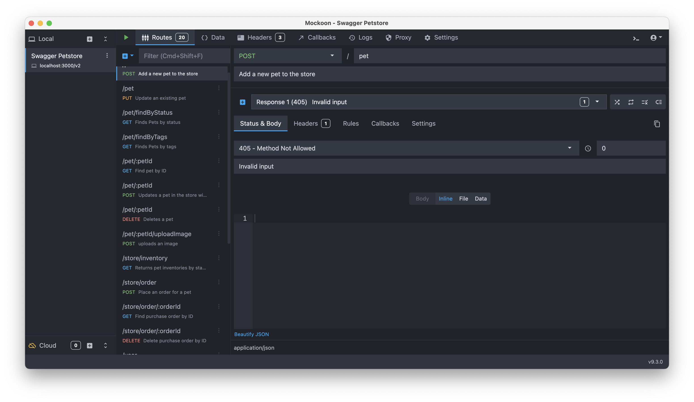

+++
date = '2025-10-08T22:11:17+02:00'
title = 'Mockoon - http api mocking made easy'
+++

[Mockoon](https://mockoon.com) is a great tool for mocking http servers or apis. It's open source, has a great ui that gets you up and running fast and a powerful feature set that will let you use and deploy your mocks in many ways.

Starting a mock is easy, you can import an Open Api spec or build routes by hand. For your responses you can use [Faker.js helpers](https://mockoon.com/docs/v9.0.0/templating/fakerjs-helpers/) to get realistic looking but changing data. With [path and parameter parsing](https://mockoon.com/docs/v9.0.0/requests/query-parameters/) and if defs in the response templates you can serve data that matches the parameters in your requests.

Once you have a mock defined you can run it headless using the [CLI](https://mockoon.com/cli/) or create a docker container to run your mocks in CI for integration testing or as dependent services in docker-compose.

<figure>
  
  <figcaption>The Mockoon UI with an import of the Petstore Open API spec</figcaption>
</figure>

## How I use Mockoon

In my work I use Mockoon to mock services or apis that I'm building to give me flexibility in testing and development. For instance for [*In The Long Run*](http://inthelongrun.app) I have set up a mock of the back-end api for when I'm working on the front-end. That let's me easily mimic different conditions: trigger errors, mimic latency or use wonky data in responses.

I will typically add different [rules](https://mockoon.com/tutorials/responses-and-rules/) and responses to trigger different scenarios. For instance, I might reserve `PATCH /users/400` path to always trigger a 400 http error response to see how your front end handles such errors. Or have different user personas, some with huge response payloads and other with more sparse data to verify that your ui looks good for both.

But I also use Mockoon mocks for apis I don't control, for *In the Long Run* that means mocking the Strava api. This lets me easily test scenarios that I don't control or might not want to trigger in the actual api (rate limiting for example).

Lastly sometimes I use Mockoon in [proxy mode](https://mockoon.com/tutorials/partial-mocking-proxy/). That lets you call through to a proxy for paths you haven't defined mocks for and also let you keep track of what requests you are making and what you are getting back which can be useful when logs disappear or redirects swallow your network tab history.

On top of these features Mockoon does a ton of stuff I haven't dug into yet. CRUD endpoints, data buckets and a cloud version for collaboration. I hope to be able to try out some of those in the future. I've been using Mockoon for a few years, I admire the team for how much they have been able to ship and for the intuitive ui they have built for it.

So highly recommend you check out Mockoon and if you have the time and resources, contribute or support the project!